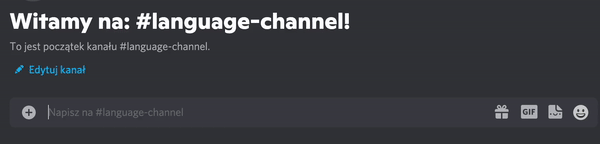
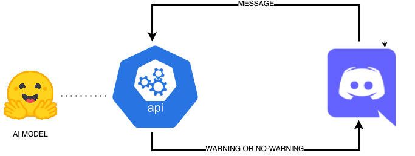

# Discord-Language-Bot
Restrict the use of banned languages on your discord server. 
Use the language detection model with [hugging face](https://huggingface.co/papluca/xlm-roberta-base-language-detection) 
to detect the language used by members of your discord channel. 

If you want to prevent your server members from using languages other than the approved set, the bot will warn them. 
This code is just a starting point for more advanced responses, which can easily be built on top of existing codebase.
 

<p align="center">  </p>

# TL; DR:

```
echo "<HERE-YOUR-TOKEN>" > discord_token.txt

docker-compose up
```

# How does it work

The following repo is a simple but useful way to restrict the use of certain languages on your discord server.
It is based on the [XLM-RoBERTa](https://huggingface.co/papluca/xlm-roberta-base-language-detection) model trained on the [language identification dataset](https://huggingface.co/papluca/xlm-roberta-base-language-detection).

The message is sent to the bot (API), and if it contains an unwanted language, the user receives a warning.

<p align="center">  </p>

The code itself is super simple and should be treated more as a starting point for future modifications. 
99% of the "business logic" can be found in [on_message](https://github.com/tugot17/Discord-Language-Bot/blob/2ac23d10f428da8d5f71af9a089587e11cce93df/app/main.py#L24)
function.

To make the bot useful you will need a token. [Here](https://www.writebots.com/discord-bot-token/) you can find a step by step tutorial.
Once you have a working token you need to save it to the `discord_token.txt` file. You can do this by running:  

```
echo "<HERE-YOUR-TOKEN>" > discord_token.txt
```

where `<HERE-YOUR-TOKEN>` is something like: `OTIIzaaTcjY2xOussUy.YbkUkg.Eg.zhsN2ytTud1ClfeHGaTS`
This will be used to authorize [discord client](https://discordpy.readthedocs.io/en/stable/api.html#client).

This will be used to authorize [discord client](https://discordpy.readthedocs.io/en/stable/api.html#client).

```
docker-compose up
```

All request will be logged, so you can actively observe what the bot is doing.

# FAQ
**Q:** How to change the language or message?

**A:** In [config.yaml](config.yaml) you can change the allowed languages, 
the returned message or the length of sentences that are not checked by the bot. 
The last one if useful cause the model sometimes tend to have a problem with shorter messages like "xd" or ":(".    
```yaml
min_post_char_length: 15

accepted_languages: [en]

message: "Please use English on this server"
```

##

**Q:** What languages are available in the model? 

**A:** arabic (ar), bulgarian (bg), german (de), modern greek (el), english (en), spanish (es), french (fr), hindi (hi), italian (it), japanese (ja), dutch (nl), polish (pl), portuguese (pt), russian (ru), swahili (sw), thai (th), turkish (tr), urdu (ur), vietnamese (vi), and chinese (zh)

##

**Q:** What about misspellings of words. Will the model still work?  

**A:** Yes, the model seems to do great even with misspelled sentences.

##

**Q:** Can I deploy that using AWS Lambda/Azure Functions

**A:** As far as I know, you can't because the acceptable latency to run the lambda will be too high to make it useful, but let me know if you know it's possible, I'd be happy to try running it that way. 
But services like `Azure Container Instance` or a simple `EC2` machine should work great. 
##

**Q:** Can I use this repo to harass minorities on my server? 

**A:** No! The license prohibits you from doing that. 
